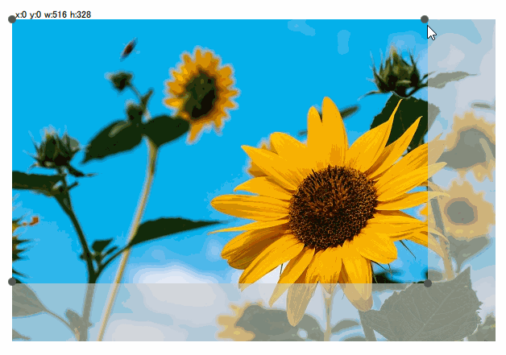

# Crop Box (require Qt 5.12)

The **CropBox** is an external QML UI component, it basically looks like the box shows when you using tool's marquee like the PhotoShop or the Windows Screenshot.
Use it just `import` the `CropBox` folder into your project, and put `CropBox` cover the item which you want to crop.

Thanks, @eyllanesc's answer in SO.

